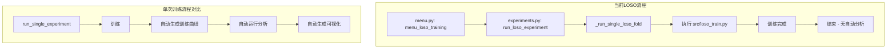
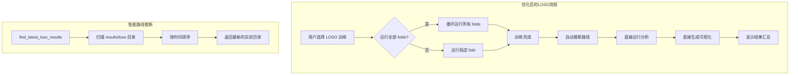
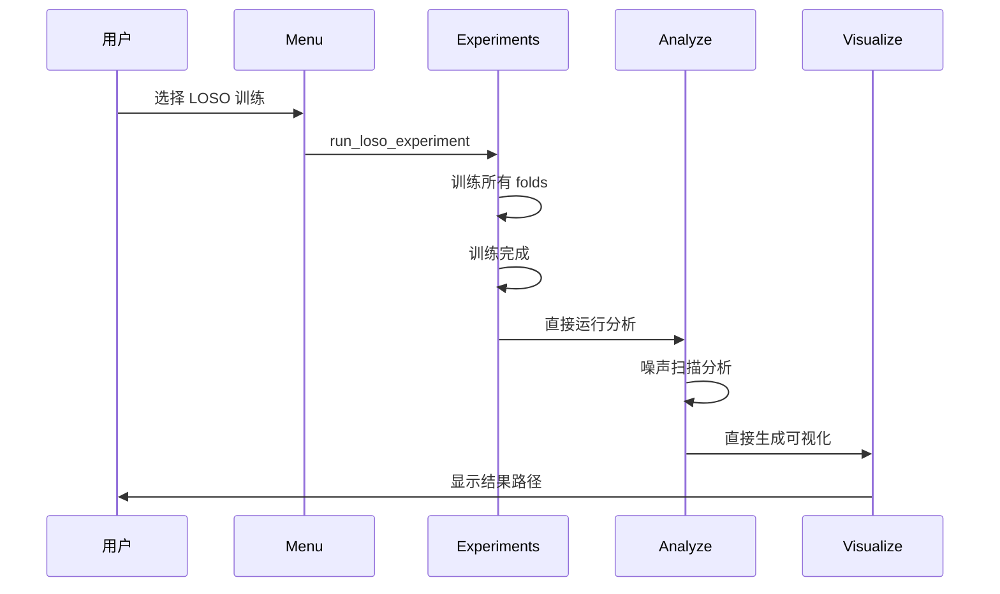

# LOSO 实验后分析与可视化优化方案

## 1. 现状分析

### 1.1 代码流程分析



### 1.2 发现的问题

| 问题 | 文件位置 | 具体描述 |
|------|----------|----------|
| **问题1** | [`_run_single_loso_fold()`](scripts/menu/experiments.py:366) | LOSO 训练结束后没有调用分析和可视化步骤 |
| **问题2** | [`run_single_experiment()`](scripts/menu/experiments.py:195) | 只有单次训练才有完整的 训练→分析→可视化 流程 |
| **问题3** | [`_menu_analyze()`](scripts/menu.py:1036) | 手动运行分析时需要用户手动输入 checkpoint 路径和输出目录 |
| **问题4** | [`_menu_visualize()`](scripts/menu.py:1053) | 手动可视化时需要输入 results_dir 和 output_dir |

### 1.3 关键函数关系

| 函数 | 位置 | 功能 | 是否自动运行分析 |
|------|------|------|------------------|
| `run_single_experiment()` | experiments.py:195 | 单次训练 | ✅ 是 |
| `run_loso_experiment()` | experiments.py:308 | LOSO 交叉验证 | ❌ 否 |
| `_run_single_loso_fold()` | experiments.py:366 | 运行单个 LOSO fold | ❌ 否 |
| `run_analysis_only()` | experiments.py:436 | 仅运行分析 | N/A |
| `run_visualization_only()` | experiments.py:483 | 仅运行可视化 | N/A |

### 1.4 分析/可视化脚本参数

**src/analyze.py (Hydra 配置)**:
- `+ckpt_path=路径` - 必需，checkpoint 文件路径
- `+analysis.output_dir=路径` - 输出目录
- `model=xxx` - 模型类型
- `dataset=xxx` - 数据集类型
- `sr/mechanism=xxx` - SR 机制
- `sr/noise=xxx` - 噪声类型

**src/visualize.py (argparse)**:
- `--results-dir` 或 `-r` - 包含 noise_sweep_results.csv 的目录
- `--output-dir` 或 `-o` - 输出目录，默认 results_dir/figures
- `--dataset` - bci2a 或 bci2b
- `--training-curves` - 生成训练曲线模式
- `--metrics-csv` - 指定 metrics.csv 路径

---

## 2. 优化方案

### 2.1 整体设计



### 2.2 需要修改的文件

#### 文件 1: scripts/menu/experiments.py

**修改内容 A - 添加智能路径推断函数**:

```python
def find_latest_loso_output_dir(exp_name: str = None) -> Optional[str]:
    """
    查找最新的 LOSO 实验输出目录
    
    Args:
        exp_name: 可选的实验名称前缀
    
    Returns:
        最新的输出目录路径
    """
    loso_dir = Path("./results/loso")
    if not loso_dir.exists():
        return None
    
    dirs = sorted(
        loso_dir.glob(f"{exp_name}*" if exp_name else "*"),
        key=lambda p: p.stat().st_mtime,
        reverse=True
    )
    
    return str(dirs[0]) if dirs else None


def find_latest_experiment_results() -> Optional[str]:
    """
    智能查找最新的实验结果目录
    优先级: results/ 下按修改时间排序
    """
    results_dir = Path("./results")
    if not results_dir.exists():
        return None
    
    # 收集所有包含 noise_sweep_results.csv 的目录
    valid_dirs = []
    for d in results_dir.rglob("noise_sweep_results.csv"):
        valid_dirs.append(d.parent)
    
    if not valid_dirs:
        return None
    
    # 按修改时间排序
    valid_dirs.sort(key=lambda p: p.stat().st_mtime, reverse=True)
    return str(valid_dirs[0])
```

**修改内容 B - 修改 `_run_single_loso_fold()` 返回训练信息**:

```python
def _run_single_loso_fold(config: ExperimentConfig,
                          fold_id: int,
                          output_dir: str,
                          n_folds: int = 9) -> Tuple[bool, Optional[str]]:
    """运行单个 LOSO fold，返回 (成功状态, checkpoint路径)"""
    # ... 现有训练代码 ...
    
    if success:
        ckpt_path = find_latest_checkpoint()
        return True, ckpt_path
    return False, None
```

**修改内容 C - 修改 `run_loso_experiment()` 添加自动后处理**:

```python
def run_loso_experiment(config: ExperimentConfig,
                        fold_id: Optional[int] = None,
                        run_all_folds: bool = False,
                        n_folds: int = 9) -> bool:
    """
    运行 LOSO 交叉验证实验
    训练完成后自动运行分析和可视化（无需询问）
    """
    # ... 现有训练代码 ...
    
    # 训练完成后直接运行自动处理（无需询问）
    if success:
        print_separator("═")
        print_info("训练完成，自动开始后处理...")
        
        # 查找最新的 checkpoint
        ckpt_path = find_latest_checkpoint()
        if ckpt_path:
            # 直接运行分析
            print_info("[1/3] 运行噪声扫描分析...")
            run_analysis_only(ckpt_path, config, output_dir)
            
            # 直接生成训练曲线
            print_info("[2/3] 生成训练收敛曲线...")
            visualize_training_curves(output_dir=f"{output_dir}/figures")
            
            # 直接生成分析结果可视化
            print_info("[3/3] 生成分析结果可视化...")
            run_visualization_only(
                results_dir=output_dir,
                include_training_curves=False,
                dataset=config.dataset
            )
            
            print_success(f"所有处理完成！结果保存在: {output_dir}")
        else:
            print_warning("未找到 checkpoint，跳过自动分析")
    
    return success
```

#### 文件 2: scripts/menu.py

**修改内容 A - 优化 `_menu_analyze()` 的路径输入**:

```python
def _menu_analyze():
    """分析已训练模型 - 优化版"""
    print_menu_header("模型分析", "🔍")
    
    # 显示快捷选项
    print("选择检查点来源:")
    print("  [1] 最新训练结果 (自动检测)")
    print("  [2] 最新 LOSO 实验")
    print("  [3] 手动选择检查点")
    print("  [0] ← 返回")
    print()
    
    choice = get_choice("请选择: ", ["0", "1", "2", "3"])
    
    if choice == "0":
        return
    
    ckpt_path = None
    output_dir = None
    
    if choice == "1":
        ckpt_path = find_latest_checkpoint()
        if ckpt_path:
            # 从 checkpoint 路径推断输出目录
            output_dir = f"./results/{config.get_experiment_name()}"
            print_info(f"检测到最新 checkpoint: {ckpt_path}")
    elif choice == "2":
        # 查找最新的 LOSO 输出目录
        latest_loso = find_latest_loso_output_dir()
        if latest_loso:
            # 在 LOSO 目录中查找 checkpoint
            ckpt_path = find_checkpoint_in_dir(latest_loso)
            output_dir = latest_loso
            print_info(f"检测到最新 LOSO 实验: {latest_loso}")
    elif choice == "3":
        ckpt_path = select_checkpoint()
        output_dir = get_input("请输入输出目录 [默认: ./results/analysis]: ", 
                               "./results/analysis")
    
    if not ckpt_path:
        print_error("未找到有效的 checkpoint")
        wait_for_enter()
        return
    
    # 确认并运行
    print()
    print_info(f"Checkpoint: {ckpt_path}")
    print_info(f"输出目录: {output_dir}")
    
    if confirm("确认运行分析? [Y/n]: "):
        run_analysis_only(ckpt_path, config, output_dir)
    
    wait_for_enter()
```

**修改内容 B - 优化 `_menu_visualize()` 的路径输入**:

```python
def _menu_visualize():
    """生成可视化图表 - 优化版"""
    print_menu_header("可视化", "📈")
    
    print("选择结果来源:")
    print("  [1] 最新分析结果 (自动检测)")
    print("  [2] 最新 LOSO 实验")
    print("  [3] 手动输入路径")
    print()
    
    source_choice = get_choice("请选择 [1-3]: ", ["1", "2", "3"])
    
    results_dir = None
    
    if source_choice == "1":
        results_dir = find_latest_experiment_results()
        if results_dir:
            print_info(f"检测到最新结果: {results_dir}")
    elif source_choice == "2":
        results_dir = find_latest_loso_output_dir()
        if results_dir:
            print_info(f"检测到最新 LOSO: {results_dir}")
    elif source_choice == "3":
        results_dir = get_input(
            "请输入结果目录路径 [默认: ./results/analysis]: ", 
            "./results/analysis"
        )
    
    if not results_dir:
        print_error("未找到有效的结果目录")
        wait_for_enter()
        return
    
    # ... 后续可视化类型选择代码保持不变 ...
```

---

## 3. 实施步骤

### 步骤概览

| 步骤 | 文件 | 修改内容 |
|------|------|----------|
| 1 | experiments.py | 添加 `find_latest_loso_output_dir()` 函数 |
| 2 | experiments.py | 添加 `find_latest_experiment_results()` 函数 |
| 3 | experiments.py | 修改 `_run_single_loso_fold()` 返回 checkpoint 路径 |
| 4 | experiments.py | 修改 `run_loso_experiment()` 添加自动分析/可视化 |
| 5 | menu.py | 优化 `_menu_analyze()` 添加快捷选项 |
| 6 | menu.py | 优化 `_menu_visualize()` 添加快捷选项 |
| 7 | menu.py | 在 `menu_loso_training()` 结尾添加后处理提示 |

---

## 4. 预期效果

### 4.1 LOSO 训练完成后
- 训练完成后直接自动运行分析和可视化（无需询问）
- 系统自动推断路径并执行
- 结果保存在 `results/loso/{实验名}/` 目录下

### 4.2 手动分析/可视化
- 用户可以选择"最新训练结果"或"最新 LOSO 实验"
- 系统自动检测并显示路径
- 减少手动输入路径的需求

### 4.3 工作流改进



---

## 5. 待确认问题

1. **LOSO 分析策略**: 对于 LOSO 实验（多个 folds），是否需要：
   - A) 只分析最后一个 fold 的结果
   - B) 对每个 fold 分别进行分析
   - C) 汇总所有 folds 的结果进行综合分析

2. **输出目录结构**: LOSO 实验的输出目录是否需要按 fold 分组？
   ```
   results/loso/conformer_bci2a_loso_additive_gaussian/
   ├── fold_1/
   ├── fold_2/
   ├── ...
   └── summary/   # 汇总分析
   ```