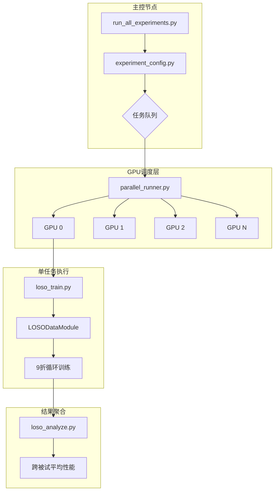
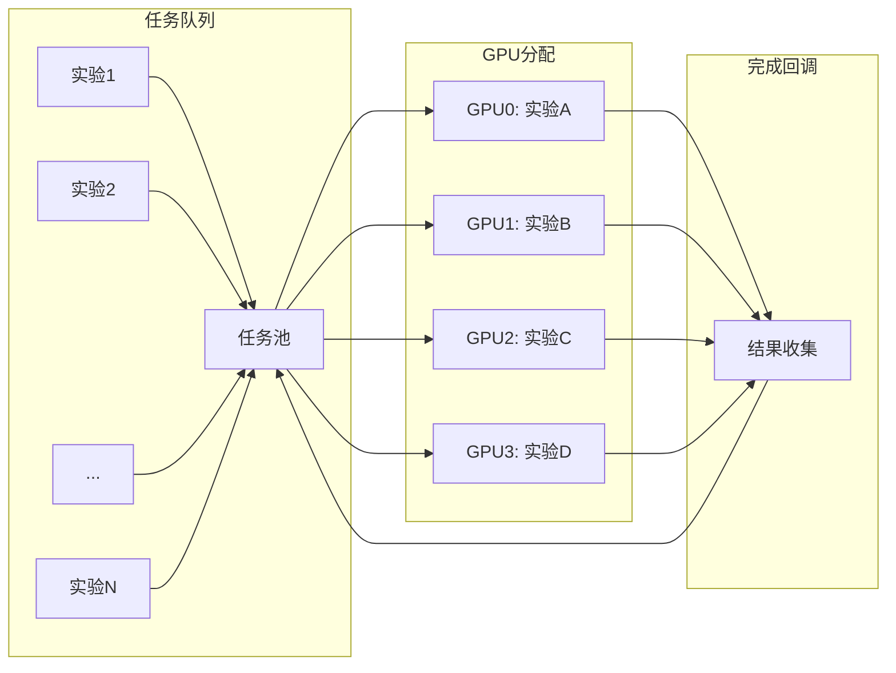

# LOSO + 多 GPU 并行改造计划

## 📋 项目改造概述

将当前"按被试独立训练"模式改为"留一被试交叉验证 (LOSO)"，并实现多 GPU 任务级并行，以最大化 GPU 利用率和实验吞吐量。

---

## 🏗️ 系统架构



---

## 📁 新增/修改文件清单

### 1. 可配置折数分配系统

#### `src/data/fold_utils.py` (新建)

```python
class FoldSplitter:
    """可配置折数的被试分配器"""
    
    def __init__(self, subject_ids: List[int], n_folds: int = 3):
        """
        Args:
            subject_ids: 所有被试 ID 列表，如 [1,2,3,4,5,6,7,8,9]
            n_folds: 折数，默认 3 折
        """
        self.subject_ids = subject_ids
        self.n_folds = n_folds
        self.folds = self._create_folds()
    
    def _create_folds(self) -> List[Dict]:
        """创建折数分配"""
        n_subjects = len(self.subject_ids)
        subjects_per_fold = n_subjects // self.n_folds
        remainder = n_subjects % self.n_folds
        
        folds = []
        start = 0
        for i in range(self.n_folds):
            # 均匀分配，余数分给前几折
            size = subjects_per_fold + (1 if i < remainder else 0)
            test_subjects = self.subject_ids[start:start + size]
            train_subjects = [s for s in self.subject_ids if s not in test_subjects]
            folds.append({
                'fold_id': i + 1,
                'test_subjects': test_subjects,
                'train_subjects': train_subjects
            })
            start += size
        return folds
    
    def get_fold(self, fold_id: int) -> Dict:
        """获取指定折的分配"""
        return self.folds[fold_id - 1]
    
    def print_allocation(self):
        """打印分配方案"""
        print(f"\n{'='*50}")
        print(f"Leave-{len(self.folds[0]['test_subjects'])}-Out 交叉验证 ({self.n_folds} 折)")
        print(f"{'='*50}")
        for fold in self.folds:
            print(f"\nFold {fold['fold_id']}:")
            print(f"  测试: {fold['test_subjects']}")
            print(f"  训练: {fold['train_subjects']}")
        print(f"\n{'='*50}\n")

# 使用示例
splitter = FoldSplitter([1,2,3,4,5,6,7,8,9], n_folds=3)
splitter.print_allocation()
# 输出:
# ==================================================
# Leave-3-Out 交叉验证 (3 折)
# ==================================================
# Fold 1:
#   测试: [1, 2, 3]
#   训练: [4, 5, 6, 7, 8, 9]
# Fold 2:
#   测试: [4, 5, 6]
#   训练: [1, 2, 3, 7, 8, 9]
# Fold 3:
#   测试: [7, 8, 9]
#   训练: [1, 2, 3, 4, 5, 6]
# ==================================================
```

### 2. 数据模块改造

#### `src/data/loso_datamodule.py` (新建)

```python
# 核心功能：
# - 支持可配置 n_folds 参数（默认 3 折）
# - 使用 FoldSplitter 计算当前折的训练/测试被试
# - 启动时显示折数分配方案
```

**关键接口：**
```python
class LOSODataModule(pl.LightningDataModule):
    def __init__(
        self,
        dataset_name: str,
        all_subject_ids: List[int],  # [1,2,3,4,5,6,7,8,9]
        n_folds: int = 3,             # 折数，默认 3 折
        fold_id: int = 1,             # 当前折 ID (1-based)
        val_ratio: float = 0.1,       # 从训练被试中划分验证集
        show_fold_info: bool = True,  # 是否显示分配信息
        ...
    )
    
    def setup(self, stage=None):
        # 1. 计算当前折的训练/测试被试
        splitter = FoldSplitter(self.all_subject_ids, self.n_folds)
        if self.show_fold_info:
            splitter.print_allocation()
        
        fold = splitter.get_fold(self.fold_id)
        self.test_subjects = fold['test_subjects']
        self.train_subjects = fold['train_subjects']
        
        # 2. 加载对应被试的数据
        ...
```

### 2. 训练入口改造

#### `src/loso_train.py` (新建)

```python
# 核心功能：
# - 接收 fold_id 参数（即 test_subject_id）
# - 调用 LOSODataModule
# - 执行单折训练并保存结果
```

### 3. 并行调度器

#### `scripts/parallel_runner.py` (新建)

```python
# 核心功能：
# - 接收实验配置列表
# - 检测可用 GPU 数量
# - 使用进程池分配任务到不同 GPU
# - 支持断点续跑

class ParallelRunner:
    def __init__(self, gpu_ids: List[int], max_concurrent: int = None):
        ...
    
    def run_experiments(self, experiments: List[ExperimentConfig]):
        # 使用 multiprocessing.Pool 或 concurrent.futures
        ...
```

### 4. 实验配置生成器

#### `scripts/experiment_config.py` (新建)

```python
# 核心功能：
# - 生成所有实验组合
# - 2 数据集 × 2 模型 × 3 机制 × 5 噪声 × N 强度 × 9 折

def generate_all_experiments(
    datasets: List[str] = ['bci2a', 'bci2b'],
    models: List[str] = ['eegnet', 'conformer'],
    mechanisms: List[str] = ['additive', 'bistable', 'tristable'],
    noises: List[str] = ['gaussian', 'uniform', 'alpha_stable', 'poisson', 'colored'],
    intensities: List[float] = np.arange(0.1, 2.1, 0.1).tolist(),
    n_folds: int = 9
) -> List[ExperimentConfig]:
    ...
```

---

## 📊 实验规模分析

### 完整实验组合

| 因素 | 数量 | 说明 |
|------|------|------|
| 数据集 | 2 | BCI2a, BCI2b |
| 模型 | 2 | EEGNet, Conformer |
| SR 机制 | 3 | Additive, Bistable, Tristable |
| 噪声类型 | 5 | Gaussian, Uniform, Alpha, Poisson, Colored |
| 噪声强度 | 20 | 0.1 到 2.0，步长 0.1 |
| LOSO 折数 | 9 | 每数据集 9 个被试 |

**总实验数 = 2 × 2 × 3 × 5 × 20 × 9 = 10,800**

### 单次训练时间估算 (RTX 4090)

| 模型 | 数据量 | 50 epoch | Early Stop 平均 |
|------|--------|----------|-----------------|
| EEGNet | 8 被试 | ~3 分钟 | ~2 分钟 |
| Conformer | 8 被试 | ~8 分钟 | ~5 分钟 |

**加权平均：~3.5 分钟/实验**

---

## 🖥️ GPU 选型建议

### AutoDL 可用 GPU 完整分析

| GPU 型号 | 显存 | 架构 | FP16 算力 | 单价估算 | 推荐指数 |
|----------|------|------|-----------|----------|----------|
| **RTX 5090** | 32GB | Blackwell | ~400 TFLOPS | ¥3-4/h | ⭐⭐⭐⭐ 最新 |
| **RTX 5090D** | 32GB | Blackwell | ~350 TFLOPS | ¥2.5-3.5/h | ⭐⭐⭐⭐ |
| **RTX Pro 6000** | 48GB | Blackwell | ~400 TFLOPS | ¥4-5/h | ⭐⭐⭐ 显存大 |
| **H800** | 80GB | Hopper | ~990 TFLOPS | ¥8-12/h | ⭐⭐ 性价比低 |
| **H20** | 96GB | Hopper | ~296 TFLOPS | ¥5-8/h | ⭐⭐ |
| **L40** | 48GB | Ada | ~362 TFLOPS | ¥3-4/h | ⭐⭐⭐ |
| **L20** | 48GB | Ada | ~240 TFLOPS | ¥2-3/h | ⭐⭐⭐ |
| **RTX 4090** | 24GB | Ada | ~330 TFLOPS | ¥1.98/h | ⭐⭐⭐⭐⭐ 性价比最高 |
| **RTX 4090D** | 24GB | Ada | ~280 TFLOPS | ¥1.58/h | ⭐⭐⭐⭐ |
| **RTX 4080** | 16GB | Ada | ~200 TFLOPS | ¥1.2/h | ⭐⭐⭐ |
| vGPU-32G | 32GB | 虚拟化 | ~150 TFLOPS | ¥1.5/h | ⭐⭐ |
| vGPU-48G | 48GB | 虚拟化 | ~200 TFLOPS | ¥2/h | ⭐⭐ |

### 🏆 推荐配置

#### 方案 A：性价比之王 ⭐推荐
```
4 × RTX 4090
- 总价：¥7.92/小时
- 并行任务数：4
- 预计总时间：10,800 × 3.5 / 4 / 60 ≈ 157 小时 ≈ 6.5 天
- 预计总费用：¥1,243
```

#### 方案 B：新架构尝鲜
```
4 × RTX 5090
- 总价：~¥14/小时
- 并行任务数：4
- 预计总时间：10,800 × 2.5 / 4 / 60 ≈ 112 小时 ≈ 4.7 天
- 预计总费用：¥1,568
- 优势：Blackwell 架构 FP8 支持，训练更快
```

#### 方案 C：极速完成
```
8 × RTX 4090
- 总价：¥15.84/小时
- 并行任务数：8
- 预计总时间：10,800 × 3.5 / 8 / 60 ≈ 79 小时 ≈ 3.3 天
- 预计总费用：¥1,251
```

#### 方案 D：预算优先
```
4 × RTX 4090D
- 总价：¥6.32/小时
- 并行任务数：4
- 预计总时间：10,800 × 4.0 / 4 / 60 ≈ 180 小时 ≈ 7.5 天
- 预计总费用：¥1,138
```

### 💡 选择建议

1. **首选 4 × RTX 4090**：性价比最高，Ada 架构成熟稳定
2. **预算充足可选 8 × RTX 4090**：时间减半，总费用相近
3. **RTX 4080 不推荐**：16GB 显存略小，价格优势不明显
4. **H800/H20 不推荐**：虽然算力强但单价高，任务级并行下优势不明显

---

## ⚡ 优化策略

### 1. 混合精度训练 (AMP)

```yaml
# conf/config.yaml
trainer:
  precision: 16-mixed  # 或 bf16-mixed (A100/4090 支持)
```

**收益：训练速度提升 30-50%，显存占用降低 40%**

### 2. 增大 Batch Size

由于 LOSO 使用 8 个被试的数据，数据量增加约 8 倍：

```yaml
# conf/dataset/bci2a_loso.yaml
batch_size: 128  # 原 64 → 128
num_workers: 8   # 原 4 → 8
```

### 3. 梯度累积 (可选)

如果想模拟更大 batch：

```yaml
trainer:
  accumulate_grad_batches: 2  # 有效 batch = 128 × 2 = 256
```

### 4. 数据预加载

```python
# 在 AutoDL 上将数据集放到 /root/autodl-tmp/ (SSD)
data_dir: /root/autodl-tmp/data
```

---

## 🔄 并行策略

### 任务级并行 (推荐)



**实现方式：**
```python
import multiprocessing as mp
from concurrent.futures import ProcessPoolExecutor

def run_single_experiment(config, gpu_id):
    os.environ['CUDA_VISIBLE_DEVICES'] = str(gpu_id)
    # 运行训练...

with ProcessPoolExecutor(max_workers=4) as executor:
    futures = []
    for i, config in enumerate(all_configs):
        gpu_id = i % num_gpus
        futures.append(executor.submit(run_single_experiment, config, gpu_id))
```

---

## 📝 配置文件修改

### `conf/dataset/bci2a_loso.yaml`

```yaml
_target_: src.data.loso_datamodule.LOSODataModule
dataset_name: BNCI2014_001
all_subject_ids: [1, 2, 3, 4, 5, 6, 7, 8, 9]
test_subject_id: 1  # 可通过命令行覆盖
val_ratio: 0.1
n_classes: 4
tmin: 0.0
tmax: 4.0
fmin: 4.0
fmax: 38.0
batch_size: 128
num_workers: 8
pin_memory: true
persistent_workers: true
seed: ${seed}
```

### `conf/config.yaml` 添加

```yaml
trainer:
  precision: 16-mixed
  max_epochs: 50
  accelerator: gpu
  devices: 1
  strategy: auto

# LOSO 实验配置
loso:
  enabled: true
  n_folds: 9

# 并行运行配置
parallel:
  num_gpus: 4
  experiments_per_gpu: 1
```

---

## 🚀 AutoDL 部署流程

### 1. 创建实例
- 选择 **4 × RTX 4090** 配置
- 选择 PyTorch 2.0+ 镜像
- 选择 CUDA 12.x

### 2. 环境初始化

```bash
# autodl_setup.sh
#!/bin/bash

# 1. 安装依赖
pip install -r requirements.txt

# 2. 预下载数据集到 SSD
python -c "
from braindecode.datasets import MOABBDataset
MOABBDataset('BNCI2014_001', subject_ids=[1,2,3,4,5,6,7,8,9])
MOABBDataset('BNCI2014_004', subject_ids=[1,2,3,4,5,6,7,8,9])
"

# 3. 移动数据到 SSD
mv ~/mne_data /root/autodl-tmp/

# 4. 验证 GPU
nvidia-smi
python -c "import torch; print(f'GPUs: {torch.cuda.device_count()}')"
```

### 3. 运行实验

```bash
# 运行所有实验
python scripts/run_all_experiments.py \
    --gpus 0,1,2,3 \
    --output-dir /root/autodl-tmp/results

# 或指定部分实验
python scripts/run_all_experiments.py \
    --datasets bci2a \
    --models eegnet \
    --mechanisms additive bistable \
    --gpus 0,1,2,3
```

---

## 🔄 断点续跑机制设计

### 状态持久化

```python
# scripts/experiment_state.py
class ExperimentState:
    """实验状态管理，支持断点续跑"""
    
    def __init__(self, state_file: str = "experiment_state.json"):
        self.state_file = state_file
        self.state = {
            "total_experiments": 0,
            "completed": [],
            "failed": [],
            "pending": [],
            "current_running": []
        }
    
    def mark_completed(self, exp_id: str):
        """标记实验完成"""
        ...
    
    def get_pending(self) -> List[str]:
        """获取待运行实验"""
        ...
    
    def save(self):
        """保存状态到文件"""
        ...
    
    def load(self):
        """从文件恢复状态"""
        ...
```

### 实验 ID 命名规范

```
{dataset}_{model}_{mechanism}_{noise}_D{intensity}_fold{fold_id}

示例：
bci2a_eegnet_additive_gaussian_D0.5_fold3
bci2b_conformer_bistable_colored_D1.2_fold7
```

### 目录结构

```
results/
├── experiment_state.json          # 实验状态文件
├── bci2a/
│   ├── eegnet/
│   │   ├── additive_gaussian/
│   │   │   ├── D0.1/
│   │   │   │   ├── fold1/
│   │   │   │   │   ├── metrics.csv
│   │   │   │   │   ├── best.ckpt
│   │   │   │   │   └── test_results.json
│   │   │   │   ├── fold2/
│   │   │   │   └── ...
│   │   │   └── summary.csv
│   │   └── ...
│   └── conformer/
└── bci2b/
```

---

## 📊 结果聚合格式

### 每个噪声强度的汇总 (summary.csv)

| fold | test_subject | accuracy | f1_score | kappa |
|------|--------------|----------|----------|-------|
| 1 | Subject1 | 0.7521 | 0.7489 | 0.6694 |
| 2 | Subject2 | 0.6823 | 0.6801 | 0.5764 |
| ... | ... | ... | ... | ... |
| 9 | Subject9 | 0.7102 | 0.7045 | 0.6136 |
| **mean** | - | **0.7182** | **0.7145** | **0.6198** |
| **std** | - | **0.0342** | **0.0356** | **0.0456** |

### 全局汇总 (final_summary.csv)

| dataset | model | mechanism | noise | intensity | mean_acc | std_acc | mean_f1 | std_f1 | mean_kappa | std_kappa |
|---------|-------|-----------|-------|-----------|----------|---------|---------|--------|------------|-----------|
| bci2a | eegnet | additive | gaussian | 0.1 | 0.7182 | 0.0342 | 0.7145 | 0.0356 | 0.6198 | 0.0456 |
| ... | ... | ... | ... | ... | ... | ... | ... | ... | ... | ... |

---

## ✅ 实施检查清单

- [ ] 创建 `LOSODataModule` 类
- [ ] 创建 `loso_train.py` 入口
- [ ] 创建 `parallel_runner.py` 调度器（含断点续跑）
- [ ] 创建 `experiment_config.py` 配置生成
- [ ] 创建 `experiment_state.py` 状态管理
- [ ] 修改 `conf/config.yaml`
- [ ] 创建 LOSO 数据集配置
- [ ] 优化训练参数 (AMP, batch size)
- [ ] 创建 `loso_analyze.py` 结果聚合
- [ ] 创建 `autodl_setup.sh`
- [ ] 创建 `run_all_experiments.py`
- [ ] 测试单折训练
- [ ] 测试多 GPU 并行
- [ ] 测试断点续跑
- [ ] 完整实验运行

---

## 📊 预期结果输出

```
results/
├── bci2a/
│   ├── eegnet/
│   │   ├── additive_gaussian/
│   │   │   ├── intensity_0.1/
│   │   │   │   ├── fold_1/
│   │   │   │   │   ├── metrics.csv
│   │   │   │   │   └── best.ckpt
│   │   │   │   ├── fold_2/
│   │   │   │   └── ...
│   │   │   └── summary.csv  # 9折平均
│   │   └── ...
│   └── conformer/
│       └── ...
├── bci2b/
│   └── ...
└── final_summary.csv  # 所有实验汇总