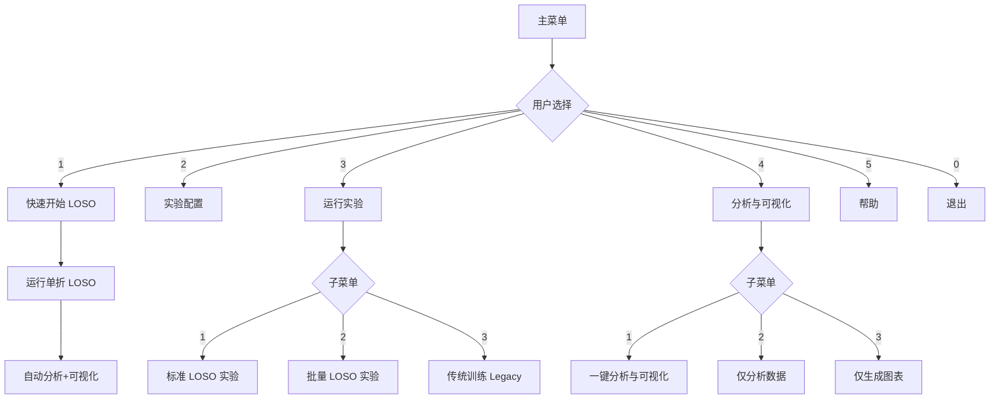
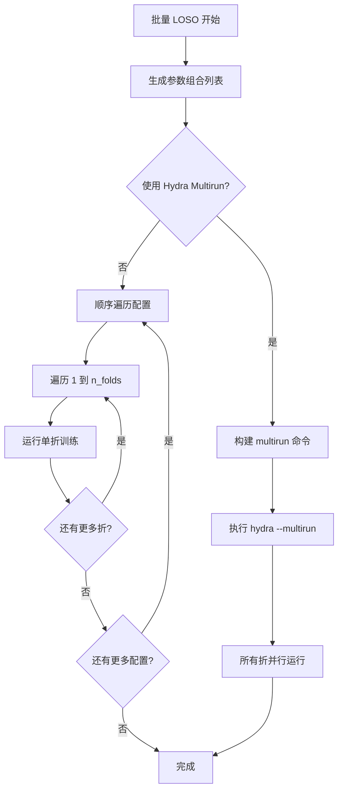
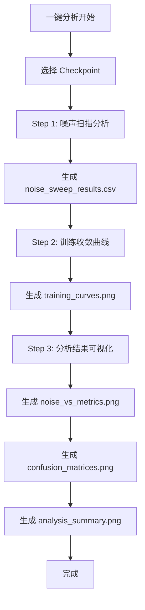

# LOSO 优先重构设计方案

## 概述

将项目重构为以 LOSO (Leave-One-Subject-Out) 交叉验证为标准实验流程，原有的标准划分作为备选项。同时优化分析与可视化流程。

---

## 1. 菜单结构重设计 (`scripts/menu.py`)

### 1.1 新主菜单结构

```
═══════════════════════════════════════════════════════
       SR-EEG 实验运行助手 v2.0
═══════════════════════════════════════════════════════
  当前: Conformer | bci2a_loso | additive | gaussian
───────────────────────────────────────────────────────

  [1] 🚀 快速开始 (LOSO)
      默认运行单折 LOSO 测试

  [2] ⚙️  实验配置
      修改模型、数据集、SR参数、训练参数

  [3] 🔬 运行实验
      LOSO 实验、批量实验、传统训练

  [4] 📊 分析与可视化
      一键分析、仅分析、仅可视化

  [5] ℹ️  帮助
      查看各功能的详细说明

  [0] 退出
```

### 1.2 快速开始菜单改动

**原逻辑**: 调用 `train.py` 进行标准训练

**新逻辑**: 调用 `loso_train.py` 运行单折 LOSO

```python
def menu_quick_start():
    """快速开始 - 默认使用 LOSO 单折测试"""
    print_menu_header("快速开始 (LOSO)", "🚀")
    
    # 显示 LOSO 配置摘要
    print(f"  LOSO 数据集:  {config.loso_dataset}")
    print(f"  当前折:       {config.loso_fold_id} / {config.loso_n_folds}")
    print(f"  模型:         {config.get_model_display_name()}")
    # ...
    
    # 默认运行 LOSO
    run_loso_experiment(config, fold_id=config.loso_fold_id, n_folds=config.loso_n_folds)
```

### 1.3 运行实验子菜单重构

```
═══════════════════════════════════════════════════════
       🔬 运行实验
═══════════════════════════════════════════════════════

  [1] 📌 标准 LOSO 实验 (推荐)
      运行指定折或全部折的 LOSO 实验

  [2] 📦 批量 LOSO 实验
      遍历参数组合，每个组合运行完整 LOSO

  [3] 📁 传统训练 (Legacy)
      使用固定训练/测试集划分

  [0] ← 返回主菜单
```

### 1.4 分析与可视化子菜单重构

```
═══════════════════════════════════════════════════════
       📊 分析与可视化
═══════════════════════════════════════════════════════

  [1] 🎯 一键分析与可视化 (推荐)
      自动执行分析并生成所有图表

  [2] 📈 仅分析数据
      生成 CSV/JSON 报告

  [3] 🖼️  仅生成图表
      基于已有分析结果绘图

  [0] ← 返回主菜单
```

---

## 2. 批量 LOSO 实验逻辑 (`scripts/menu/experiments.py`)

### 2.1 核心设计思路

批量 LOSO 实验需要处理两层循环：
1. **外层**: 参数组合 (模型 × 噪声 × 机制 × ...)
2. **内层**: LOSO 折数 (1 ~ n_folds)

**策略**: 智能多 GPU 并行，自动适配硬件环境

### 2.2 执行模式

| 环境 | 检测条件 | 执行策略 |
|------|----------|----------|
| **无 GPU** | `torch.cuda.device_count() == 0` | 单进程 CPU 顺序执行 |
| **单 GPU** | `len(gpu_ids) == 1` | 单进程 GPU 顺序执行（无进程开销） |
| **多 GPU** | `len(gpu_ids) > 1` | multiprocessing 队列 + 多 worker |

### 2.3 实现方案

```python
def run_batch_loso_parallel(
    configs: List[ExperimentConfig],
    n_folds: int = 9,
    gpu_ids: List[int] = None
) -> Tuple[int, int]:
    """
    智能并行批量 LOSO
    
    兼容性:
    - 单 GPU: gpu_ids=[0] → 单进程顺序执行所有任务
    - 多 GPU: gpu_ids=[0,1,2,3] → 4 个进程并行
    - 无 GPU: gpu_ids=None + use_cpu=True → CPU 模式
    """
    import torch
    
    # 自动检测可用 GPU
    if gpu_ids is None:
        gpu_count = torch.cuda.device_count()
        if gpu_count == 0:
            # CPU 模式：单进程顺序执行
            return _run_sequential_cpu(configs, n_folds)
        else:
            gpu_ids = list(range(gpu_count))
    
    if len(gpu_ids) == 1:
        # 单 GPU 优化：避免 multiprocessing 开销，直接循环执行
        return _run_sequential_single_gpu(configs, n_folds, gpu_ids[0])
    else:
        # 多 GPU：启动 worker 进程
        return _run_parallel_multi_gpu(configs, n_folds, gpu_ids)


def _run_parallel_multi_gpu(
    configs: List[ExperimentConfig],
    n_folds: int,
    gpu_ids: List[int]
) -> Tuple[int, int]:
    """多 GPU 并行执行"""
    import multiprocessing as mp
    
    # 构建任务队列
    task_queue = mp.Queue()
    result_queue = mp.Queue()
    
    total_tasks = 0
    for config in configs:
        for fold_id in range(1, n_folds + 1):
            task_queue.put((config, fold_id, n_folds))
            total_tasks += 1
    
    # 添加终止信号
    for _ in gpu_ids:
        task_queue.put(None)
    
    # 每个 GPU 启动一个 worker
    workers = []
    for gpu_id in gpu_ids:
        p = mp.Process(
            target=_gpu_worker,
            args=(task_queue, result_queue, gpu_id)
        )
        p.start()
        workers.append(p)
    
    # 等待所有 worker 完成
    for p in workers:
        p.join()
    
    # 统计结果
    success_count = 0
    while not result_queue.empty():
        if result_queue.get():
            success_count += 1
    
    return success_count, total_tasks


def _gpu_worker(task_queue, result_queue, gpu_id: int):
    """单 GPU worker: 不断从队列取任务执行"""
    import os
    os.environ["CUDA_VISIBLE_DEVICES"] = str(gpu_id)
    
    while True:
        task = task_queue.get()
        if task is None:
            break  # 收到终止信号
        
        config, fold_id, n_folds = task
        
        # 执行单个 LOSO fold
        success = _run_single_loso_task(config, fold_id, n_folds)
        result_queue.put(success)


def _run_sequential_single_gpu(
    configs: List[ExperimentConfig],
    n_folds: int,
    gpu_id: int
) -> Tuple[int, int]:
    """单 GPU 顺序执行（无进程开销）"""
    import os
    os.environ["CUDA_VISIBLE_DEVICES"] = str(gpu_id)
    
    total = len(configs) * n_folds
    success = 0
    
    for config in configs:
        for fold_id in range(1, n_folds + 1):
            if _run_single_loso_task(config, fold_id, n_folds):
                success += 1
    
    return success, total


def _run_sequential_cpu(
    configs: List[ExperimentConfig],
    n_folds: int
) -> Tuple[int, int]:
    """CPU 模式顺序执行"""
    total = len(configs) * n_folds
    success = 0
    
    for config in configs:
        for fold_id in range(1, n_folds + 1):
            if _run_single_loso_task(config, fold_id, n_folds, use_cpu=True):
                success += 1
    
    return success, total
```

### 2.3 进度跟踪增强

在 `experiment_state.py` 中添加 LOSO 批量进度跟踪：

```python
@dataclass
class LOSOBatchState:
    """LOSO 批量实验状态"""
    total_configs: int
    total_folds: int
    completed_configs: int = 0
    completed_folds: int = 0
    current_config_idx: int = 0
    current_fold_id: int = 0
    failed_runs: List[Tuple[int, int]] = field(default_factory=list)
    
    @property
    def total_runs(self) -> int:
        return self.total_configs * self.total_folds
    
    @property
    def completed_runs(self) -> int:
        return self.completed_configs * self.total_folds + self.completed_folds
    
    @property
    def progress_percent(self) -> float:
        return self.completed_runs / self.total_runs * 100
```

---

## 3. 分析与可视化增强 (`src/visualize.py`)

### 3.1 图表信息增强

在图表标题或脚注中添加关键实验信息：

```python
def create_enhanced_figure_title(
    base_title: str,
    training_info: Optional[Dict] = None,
    analysis_info: Optional[Dict] = None
) -> str:
    """创建包含实验信息的增强标题"""
    
    info_parts = [base_title]
    
    if training_info:
        # 添加关键参数
        lr = training_info.get("learning_rate", "N/A")
        n_folds = training_info.get("n_folds", "N/A")
        fold_id = training_info.get("fold_id", "N/A")
        noise_intensity = training_info.get("intensity", "N/A")
        
        info_parts.append(f"LR={lr}, Fold={fold_id}/{n_folds}, D={noise_intensity}")
    
    return "\n".join(info_parts)


def add_figure_annotation(
    fig,
    training_info: Optional[Dict] = None
) -> None:
    """在图表底部添加实验参数注释"""
    
    if training_info:
        annotation_text = (
            f"Model: {training_info.get('model_name', 'N/A')} | "
            f"Dataset: {training_info.get('dataset_name', 'N/A')} | "
            f"Fold: {training_info.get('fold_id', 'N/A')}/{training_info.get('n_folds', 'N/A')} | "
            f"LR: {training_info.get('learning_rate', 'N/A')} | "
            f"D: {training_info.get('intensity', 'N/A')}"
        )
        
        fig.text(
            0.5, 0.02, annotation_text,
            ha='center', va='bottom',
            fontsize=8, color='gray'
        )
```

### 3.2 修改现有绘图函数

在 [`plot_noise_vs_metrics()`](src/utils/plotting.py:1) 等函数中集成信息增强：

```python
def plot_noise_vs_metrics(
    df: pd.DataFrame,
    output_path: str = None,
    training_info: Optional[Dict] = None,  # 新增参数
    show_annotations: bool = True           # 新增参数
) -> None:
    """生成噪声强度 vs 性能指标图"""
    
    fig, axes = plt.subplots(1, 3, figsize=(15, 5))
    
    # ... 原有绘图逻辑 ...
    
    # 添加实验信息注释
    if show_annotations and training_info:
        add_figure_annotation(fig, training_info)
    
    # 使用增强标题
    if training_info:
        fig.suptitle(
            create_enhanced_figure_title("Noise Intensity vs Performance", training_info),
            fontsize=14
        )
    
    plt.tight_layout()
    if output_path:
        plt.savefig(output_path, dpi=150, bbox_inches='tight')
```

### 3.3 从 training_info.json 读取信息

```python
def load_training_info(results_dir: str) -> Optional[Dict]:
    """从结果目录加载训练信息"""
    
    # 优先从 results_dir 直接查找
    info_path = os.path.join(results_dir, "training_info.json")
    
    if not os.path.exists(info_path):
        # 尝试从 lightning_logs 查找最新的
        logs_dir = Path("lightning_logs")
        if logs_dir.exists():
            versions = sorted(logs_dir.glob("version_*"), key=lambda p: p.stat().st_mtime, reverse=True)
            for v in versions:
                candidate = v / "training_info.json"
                if candidate.exists():
                    info_path = str(candidate)
                    break
    
    if os.path.exists(info_path):
        with open(info_path, "r") as f:
            return json.load(f)
    
    return None
```

---

## 4. 合并分析-可视化流程

### 4.1 新增一键处理函数

在 `scripts/menu/experiments.py` 中添加：

```python
def run_full_analysis_pipeline(
    ckpt_path: str,
    config: ExperimentConfig,
    output_dir: str
) -> bool:
    """
    一键运行完整的分析和可视化流程
    
    流程:
    1. 噪声扫描分析 (analyze.py)
    2. 训练收敛曲线 (visualize.py --training-curves)
    3. 分析结果可视化 (visualize.py --results-dir)
    """
    
    print_menu_header("一键分析与可视化", "🎯")
    
    success = True
    
    # 步骤 1: 噪声扫描分析
    print()
    print_info("[1/3] 运行噪声扫描分析...")
    if not run_analysis_only(ckpt_path, config, output_dir):
        print_warning("噪声扫描分析失败，继续后续步骤...")
        success = False
    
    # 步骤 2: 训练收敛曲线
    print()
    print_info("[2/3] 生成训练收敛曲线...")
    version_dir = find_latest_version_dir()
    if version_dir:
        curves_cmd = [
            "python", "src/visualize.py",
            "--training-curves",
            "--output-dir", f"{output_dir}/figures",
            "--prefix", f"{config.get_experiment_name()}_"
        ]
        s, _ = run_command(curves_cmd)
        if not s:
            print_warning("训练曲线生成失败")
            success = False
    else:
        print_warning("未找到训练日志，跳过训练曲线生成")
    
    # 步骤 3: 分析结果可视化
    print()
    print_info("[3/3] 生成分析结果可视化...")
    viz_cmd = [
        "python", "src/visualize.py",
        "--results-dir", output_dir,
        "--output-dir", f"{output_dir}/figures",
        "--dataset", config.dataset
    ]
    s, _ = run_command(viz_cmd)
    if not s:
        print_warning("分析结果可视化失败")
        success = False
    
    if success:
        print_success(f"所有处理完成！结果保存在: {output_dir}")
    else:
        print_warning("部分处理失败，请检查日志")
    
    return success
```

### 4.2 菜单集成

在分析与可视化菜单中添加一键选项：

```python
def menu_analysis():
    """分析与可视化菜单"""
    while True:
        print_menu_header("分析与可视化", "📊")
        
        print("  [1] 🎯 一键分析与可视化 (推荐)")
        print("      自动执行分析并生成所有图表")
        print()
        print("  [2] 📈 仅分析数据")
        print("      运行噪声扫描，生成 CSV/JSON 报告")
        print()
        print("  [3] 🖼️  仅生成图表")
        print("      基于已有分析结果绘图")
        print()
        print("  [0] ← 返回主菜单")
        print()
        
        choice = get_choice("请选择: ", ["0", "1", "2", "3"])
        
        if choice == "0":
            return
        elif choice == "1":
            _menu_full_pipeline()  # 新增
        elif choice == "2":
            _menu_analyze()
        elif choice == "3":
            _menu_visualize()
```

---

## 5. 配置文件调整

### 5.1 更新 `conf/config.yaml` 默认值

```yaml
defaults:
  - _self_
  - dataset: bci2a_loso    # 改为 LOSO 数据集
  - model: conformer       # Conformer 更常用
  - sr/mechanism: additive
  - sr/noise: gaussian
```

### 5.2 确保 LOSO 配置默认折数

`conf/dataset/bci2a_loso.yaml`:
```yaml
n_folds: 9                    # 保持默认 9 折 (完整 LOSO)
fold_id: 1                    # 默认第 1 折
```

### 5.3 更新 `scripts/menu/config.py` 默认值

```python
@dataclass
class ExperimentConfig:
    # 模型与数据 - 改为 LOSO 优先
    model: str = "conformer"
    dataset: str = "bci2a_loso"    # 改为 LOSO 数据集
    
    # LOSO 设置
    loso_dataset: str = "bci2a_loso"
    loso_n_folds: int = 9
    loso_fold_id: int = 1
    loso_run_all: bool = False
```

---

## 6. 流程图

### 6.1 主菜单流程



### 6.2 批量 LOSO 实验流程



### 6.3 一键分析可视化流程



---

## 7. 需要修改的文件清单

| 文件 | 修改内容 |
|------|----------|
| `scripts/menu.py` | 重构主菜单、快速开始逻辑、运行实验子菜单、分析可视化子菜单 |
| `scripts/menu/experiments.py` | 添加 `run_batch_loso_experiments()`、`run_full_analysis_pipeline()` |
| `scripts/menu/config.py` | 更新默认值为 LOSO 优先 |
| `src/visualize.py` | 添加 `load_training_info()`、`add_figure_annotation()`、增强绘图函数 |
| `src/utils/plotting.py` | 修改绘图函数以支持 `training_info` 参数 |
| `conf/config.yaml` | 修改默认 dataset 为 `bci2a_loso` |

---

## 8. 向后兼容性

- 保留传统训练入口作为 Legacy 选项
- 所有新功能通过可选参数实现，不破坏现有 API
- 配置文件格式保持兼容

---

## 9. 实施优先级

1. **高优先级**: 菜单结构重构 + 快速开始改为 LOSO
2. **中优先级**: 批量 LOSO 实验逻辑
3. **中优先级**: 一键分析可视化流程
4. **低优先级**: 图表信息增强