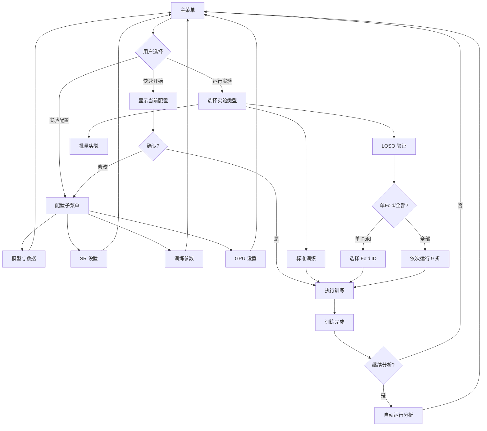
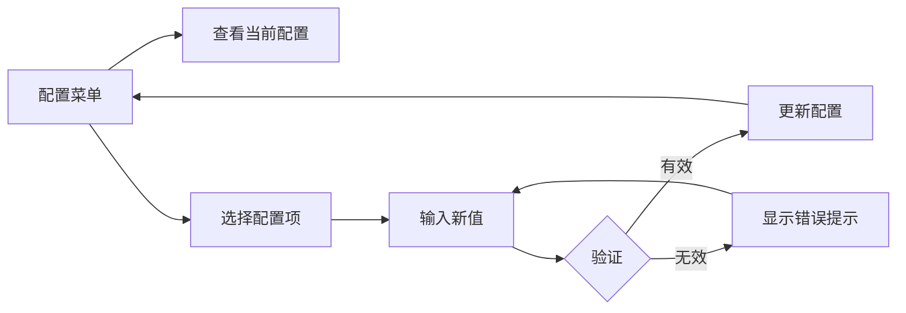

# SR-EEG 菜单系统重构设计方案

## 1. 现有问题分析

### 1.1 当前菜单结构

```
主菜单
├── [1] 单次实验
├── [2] LOSO 实验
├── [3] 批量实验
├── [4] 自定义批量
├── [5] 仅分析
├── [6] 仅可视化
├── [7] 查看可用 GPU
├── [8] 设置训练轮数
├── [9] 设置 GPU ID
└── [0] 退出
```

### 1.2 具体痛点

| 痛点 | 问题描述 | 影响 |
|------|----------|------|
| 训练模式混乱 | 单次/LOSO/批量/自定义批量 四种模式区分不清 | 用户不知道该选哪个 |
| LOSO 说明缺失 | "运行单个 fold" vs "运行所有 folds" 没有解释 | 新用户完全不理解 |
| GPU 信息过载 | 直接打印 `nvidia-smi` 原始输出 | 信息冗余，难以阅读 |
| GPU 选择盲输 | 只能手动输入数字，无法看到列表选择 | 容易出错 |
| 参数设置单一 | 只能修改 Epochs | 无法调整 batch_size、learning_rate 等 |

---

## 2. 新架构设计

### 2.1 设计原则

1. **任务导向**：按"我要做什么"组织菜单，而非按功能模块
2. **配置优先**：先完成配置，再执行任务
3. **上下文帮助**：关键选项提供简短说明
4. **渐进式复杂度**：常用功能简单直达，高级功能可选展开

### 2.2 新菜单层级结构

```
主菜单
│
├── [1] 🚀 快速开始 ─────────────────────────────────────────
│       一键运行单次实验，使用当前配置
│
├── [2] ⚙️ 实验配置 ─────────────────────────────────────────
│       │
│       ├── [2.1] 查看当前配置
│       │         显示所有参数的当前值
│       │
│       ├── [2.2] 模型与数据
│       │         ├── 选择模型: EEGNet / Conformer
│       │         └── 选择数据集: BCI2a / BCI2b
│       │
│       ├── [2.3] 随机共振设置
│       │         ├── 选择机制: Additive / Bistable / Tristable
│       │         └── 选择噪声: Gaussian / Uniform / Alpha-Stable / ...
│       │
│       ├── [2.4] 训练参数
│       │         ├── Epochs: 50
│       │         ├── Batch Size: 32
│       │         ├── Learning Rate: 0.001
│       │         └── Early Stopping Patience: 10
│       │
│       ├── [2.5] GPU 设置
│       │         显示 GPU 列表，箭头/数字选择
│       │
│       └── [2.0] ← 返回主菜单
│
├── [3] 🔬 运行实验 ─────────────────────────────────────────
│       │
│       ├── [3.1] 标准训练
│       │         使用固定训练/测试集划分进行单次训练
│       │         适用于：快速验证、调参、原型开发
│       │
│       ├── [3.2] LOSO 交叉验证
│       │         Leave-One-Subject-Out: 留一被试作为测试集
│       │         适用于：评估模型的跨被试泛化能力
│       │         │
│       │         ├── 运行指定 Fold: 只训练一个被试作为测试集
│       │         └── 运行全部 Folds: 依次用每个被试做测试 (共9折)
│       │
│       ├── [3.3] 批量实验
│       │         自动遍历多种配置组合
│       │         │
│       │         ├── 全组合模式: 所有可能的参数组合
│       │         └── 自定义模式: 选择要遍历的参数
│       │
│       └── [3.0] ← 返回主菜单
│
├── [4] 📊 分析与可视化 ─────────────────────────────────────
│       │
│       ├── [4.1] 分析已训练模型
│       │         选择检查点 → 运行噪声扫描分析
│       │
│       ├── [4.2] 生成可视化图表
│       │         ├── 训练曲线
│       │         ├── 混淆矩阵
│       │         └── 噪声-性能曲线
│       │
│       └── [4.0] ← 返回主菜单
│
├── [5] ℹ️ 帮助 ─────────────────────────────────────────────
│       显示各功能的详细说明
│
└── [0] 退出
```

---

## 3. 核心模块设计

### 3.1 全局配置状态

```python
@dataclass
class ExperimentConfig:
    # 模型与数据
    model: str = "conformer"
    dataset: str = "bci2a"
    
    # 随机共振
    mechanism: str = "additive"
    noise_type: str = "gaussian"
    
    # 训练参数
    epochs: int = 50
    batch_size: int = 32
    learning_rate: float = 0.001
    early_stopping_patience: int = 10
    
    # 硬件
    gpu_id: int = 0
    use_cpu: bool = False
```

### 3.2 GPU 选择模块

**目标**：解析系统 GPU 信息，显示简洁列表，支持交互选择

**交互示例**：
```
═══════════════════════════════════════════════════════════════
  GPU 设置
═══════════════════════════════════════════════════════════════

可用设备:

  ID   名称                          显存        使用率
  ──────────────────────────────────────────────────────────
  [0]  NVIDIA GeForce RTX 3090       24.0 GB     12%
  [1]  NVIDIA GeForce RTX 3080       10.0 GB     45%
  [C]  CPU 模式（不使用 GPU）

当前选择: GPU 0

请选择设备 [0/1/C] (直接回车保持当前): 
```

**实现思路**：
```python
def parse_gpu_info() -> List[GPUInfo]:
    """解析 GPU 信息，返回结构化数据"""
    gpus = []
    
    # 方式1: 使用 pynvml (推荐)
    try:
        import pynvml
        pynvml.nvmlInit()
        count = pynvml.nvmlDeviceGetCount()
        for i in range(count):
            handle = pynvml.nvmlDeviceGetHandleByIndex(i)
            name = pynvml.nvmlDeviceGetName(handle)
            mem_info = pynvml.nvmlDeviceGetMemoryInfo(handle)
            util = pynvml.nvmlDeviceGetUtilizationRates(handle)
            gpus.append(GPUInfo(
                id=i,
                name=name,
                memory_total=mem_info.total / 1e9,
                memory_used=mem_info.used / 1e9,
                utilization=util.gpu
            ))
        return gpus
    except ImportError:
        pass
    
    # 方式2: 解析 nvidia-smi 输出
    # ... 备选方案
    
    # 方式3: PyTorch fallback
    # ... 仅获取基本信息
```

### 3.3 参数配置模块

**目标**：允许查看和修改所有关键训练参数

**交互示例**：
```
═══════════════════════════════════════════════════════════════
  训练参数配置
═══════════════════════════════════════════════════════════════

  序号   参数名                 当前值        说明
  ──────────────────────────────────────────────────────────
  [1]    Epochs                 50           最大训练轮数
  [2]    Batch Size             32           每批样本数
  [3]    Learning Rate          0.001        初始学习率
  [4]    Early Stopping         10           提前停止耐心值

  [R]    重置为默认值
  [0]    ← 返回

请选择要修改的参数: 2
请输入新的 Batch Size [当前: 32]: 64
✓ Batch Size 已更新为 64
```

**实现思路**：
```python
# 参数定义（便于扩展）
CONFIGURABLE_PARAMS = {
    "epochs": {
        "display_name": "Epochs",
        "description": "最大训练轮数",
        "type": int,
        "default": 50,
        "range": (1, 1000)
    },
    "batch_size": {
        "display_name": "Batch Size",
        "description": "每批样本数",
        "type": int,
        "default": 32,
        "choices": [16, 32, 64, 128, 256]
    },
    "learning_rate": {
        "display_name": "Learning Rate",
        "description": "初始学习率",
        "type": float,
        "default": 0.001,
        "range": (1e-6, 1.0)
    },
    # ... 更多参数
}
```

### 3.4 LOSO 交叉验证模块

**目标**：清晰解释 LOSO 概念，引导用户选择

**交互示例**：
```
═══════════════════════════════════════════════════════════════
  LOSO 交叉验证
═══════════════════════════════════════════════════════════════

什么是 LOSO？
  Leave-One-Subject-Out（留一被试法）是一种交叉验证策略。
  数据集中有 9 个被试，每次用 1 个被试的数据做测试，
  其余 8 个被试的数据做训练。重复 9 次得到平均性能。

运行模式:

  [1] 运行单个 Fold
      只用指定的一个被试做测试集，快速验证
      
  [2] 运行全部 9 个 Folds
      完整的 LOSO 评估，获得统计显著的结果
      ⚠️ 预计需要运行 9 次完整训练

  [0] ← 返回

请选择: 1

选择测试被试 (Fold ID):
  [1] Subject 1    [4] Subject 4    [7] Subject 7
  [2] Subject 2    [5] Subject 5    [8] Subject 8
  [3] Subject 3    [6] Subject 6    [9] Subject 9

请输入 Fold ID [1-9]: 
```

### 3.5 快速开始模块

**目标**：一键运行，显示当前配置摘要

**交互示例**：
```
═══════════════════════════════════════════════════════════════
  🚀 快速开始
═══════════════════════════════════════════════════════════════

当前实验配置摘要:

  模型        EEG Conformer
  数据集      BCI Competition IV 2a (4类)
  SR 机制     Additive (加性)
  噪声类型    Gaussian (高斯)
  ─────────────────────────────────
  训练轮数    50 epochs
  批大小      32
  学习率      0.001
  GPU         #0 (RTX 3090)

实验名称: conformer_bci2a_additive_gaussian
输出目录: ./results/conformer_bci2a_additive_gaussian/

按 [Enter] 开始训练，[C] 进入配置修改，[0] 返回: 
```

---

## 4. 交互流程图

### 4.1 标准实验流程



### 4.2 配置修改流程



---

## 5. UI 组件设计

### 5.1 表格显示器

用于展示配置列表、GPU 列表等：

```python
def print_table(headers: List[str], rows: List[List[str]], 
                highlight_row: int = None):
    """打印格式化表格"""
    # 计算列宽
    col_widths = [max(len(str(cell)) for cell in col) 
                  for col in zip(headers, *rows)]
    
    # 打印表头
    header_line = "  ".join(h.ljust(w) for h, w in zip(headers, col_widths))
    print(f"  {header_line}")
    print("  " + "─" * sum(col_widths + [2 * (len(headers) - 1)]))
    
    # 打印行
    for i, row in enumerate(rows):
        line = "  ".join(str(c).ljust(w) for c, w in zip(row, col_widths))
        if i == highlight_row:
            print(f"  {line}  ← 当前")
        else:
            print(f"  {line}")
```

### 5.2 配置摘要卡片

```python
def print_config_card(config: ExperimentConfig):
    """打印配置摘要卡片"""
    print()
    print("  ┌─────────────────────────────────────┐")
    print(f"  │ 模型        {config.model:<24}│")
    print(f"  │ 数据集      {config.dataset:<24}│")
    print("  ├─────────────────────────────────────┤")
    print(f"  │ SR 机制     {config.mechanism:<24}│")
    print(f"  │ 噪声类型    {config.noise_type:<24}│")
    print("  ├─────────────────────────────────────┤")
    print(f"  │ Epochs      {config.epochs:<24}│")
    print(f"  │ Batch Size  {config.batch_size:<24}│")
    print(f"  │ GPU         #{config.gpu_id:<23}│")
    print("  └─────────────────────────────────────┘")
```

### 5.3 进度指示器

```python
def print_step_progress(current: int, total: int, description: str):
    """打印步骤进度"""
    bar_length = 30
    filled = int(bar_length * current / total)
    bar = "█" * filled + "░" * (bar_length - filled)
    print(f"\r  [{bar}] {current}/{total} {description}", end="", flush=True)
```

---

## 6. 关键功能实现要点

### 6.1 配置持久化

```python
CONFIG_FILE = Path.home() / ".sr_eeg_config.json"

def save_config(config: ExperimentConfig):
    """保存配置到用户目录"""
    with open(CONFIG_FILE, "w") as f:
        json.dump(asdict(config), f, indent=2)

def load_config() -> ExperimentConfig:
    """加载配置，如不存在则返回默认值"""
    if CONFIG_FILE.exists():
        with open(CONFIG_FILE) as f:
            return ExperimentConfig(**json.load(f))
    return ExperimentConfig()
```

### 6.2 GPU 信息缓存

```python
_gpu_cache: Optional[List[GPUInfo]] = None
_gpu_cache_time: float = 0

def get_gpu_list(refresh: bool = False) -> List[GPUInfo]:
    """获取 GPU 列表，带缓存"""
    global _gpu_cache, _gpu_cache_time
    
    if not refresh and _gpu_cache and (time.time() - _gpu_cache_time < 30):
        return _gpu_cache
    
    _gpu_cache = parse_gpu_info()
    _gpu_cache_time = time.time()
    return _gpu_cache
```

### 6.3 输入验证

```python
def get_validated_input(prompt: str, validator: Callable, 
                        error_msg: str, default=None):
    """带验证的输入获取"""
    while True:
        raw = input(prompt).strip()
        if not raw and default is not None:
            return default
        
        try:
            value = validator(raw)
            return value
        except ValueError:
            print(f"  ⚠️ {error_msg}")
```

---

## 7. 文件结构建议

```
scripts/
├── menu.py                 # 主入口，菜单循环
├── menu/
│   ├── __init__.py
│   ├── config.py           # ExperimentConfig 类
│   ├── ui.py               # UI 组件（表格、卡片、进度条）
│   ├── gpu.py              # GPU 检测与选择
│   ├── experiments.py      # 实验运行逻辑
│   └── help.py             # 帮助文本
```

---

## 8. 后续扩展点

1. **配置预设**：保存/加载常用配置组合
2. **实验队列**：批量任务排队执行
3. **远程监控**：训练状态推送通知
4. **历史记录**：自动记录每次实验的配置与结果

---

## 9. 实施计划

| 步骤 | 内容 | 依赖 |
|------|------|------|
| 1 | 创建 `ExperimentConfig` 数据类 | 无 |
| 2 | 实现 GPU 解析模块 | 无 |
| 3 | 实现 UI 组件库 | 无 |
| 4 | 重构主菜单结构 | 1, 3 |
| 5 | 实现配置子菜单 | 1, 3 |
| 6 | 实现 GPU 选择交互 | 2, 3 |
| 7 | 实现 LOSO 模块（带帮助文本） | 4 |
| 8 | 实现快速开始功能 | 4, 5 |
| 9 | 添加配置持久化 | 1 |
| 10 | 测试与调优 | 1-9 |
